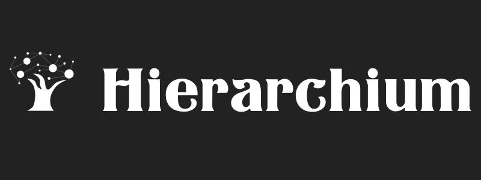

# Hierarchium

## Overview

This project is a PHP-based web application that allows users to register, authenticate, and manage hierarchical sections. It follows the MVC (Model-View-Controller) pattern and separates concerns between controllers, services, and repositories.

The project was carried out according to [the terms of reference](https://github.com/deepex/sok-task).

A [video preview](https://youtu.be/NcUw6JoqPdY) of the project.

## Built With

- [PHP](https://www.php.net/)
- [CSS3](https://developer.mozilla.org/en-US/docs/Web/CSS)
- [JS](https://developer.mozilla.org/en-US/docs/Web/JavaScript)
- [SQLite](https://www.sqlite.org/)

## Getting Started

### Run server

1. Download and install the latest version of PHP from the [PHP download page](https://www.php.net/downloads.php).
2. Start the php built-in server
```sh
php -S localhost:3000 -t public
```
3. Open your browser and go to http://localhost:3000.

### Clone the repo

```sh
git clone https://github.com/OrakomoRi/Hierarchium.git
```

## License

Distributed under the MIT License. See `LICENSE` for more information.

## Acknowledgments

* [README Template](https://github.com/othneildrew/Best-README-Template)
* [CSS Autoprefixer](https://autoprefixer.github.io/)
* [About MVC & MVVM](https://www.youtube.com/watch?v=X85soC5evw0) (in Russian)
* [Forms inspiration](https://colorlib.com/wp/html5-and-css3-login-forms/)